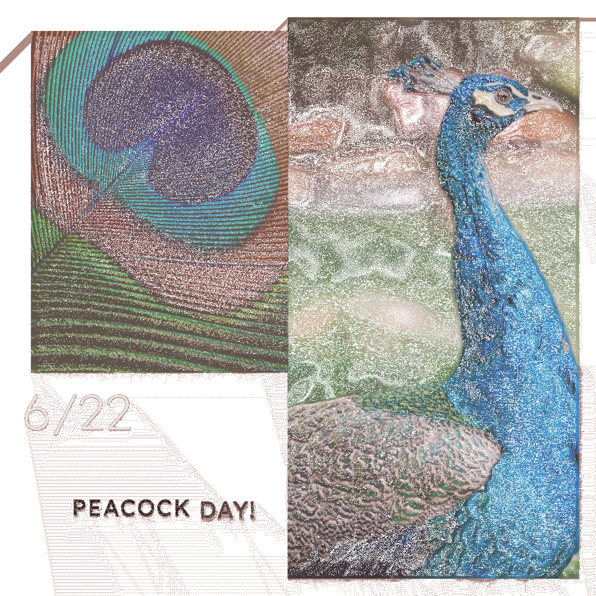

# gif.js.turbo

gif.js.turbo is an optimized and memory-efficient fork of the popular gif.js / gif.js.optimized library. It builds upon the foundation of the original gif.js / gif.js.optimized and incorporates further optimizations, resulting in enhanced performance and reduced memory footprint as well as smaller GIFs

Improvements:

- No data is being stored in the memory after, once a frame is added it is sent to a worker thread for processing. This implies that we are processing frames while they are being added and not storing them. Compared to gif.js.optimized this library consumes 3x less memory.
- Since data is being consumed by worker while frames are added, this gives a speed bump of 15-20% on average.
- Ability to send previous-frame buffer as *transferable* to reduce memory usage and increase speed.
- Adds transparency optmization which encodes only frames that have changed since the last frame to reduce size of GIF by 30-90%.
- Adds box crop offset optimization, that detects the moving part of gif and treats the rest as background, thereby reducing memory by another 5-10%.
- Micro optmization to prevent look up on indices.
- Methods are now async so no need to listen for events.
- Code now in Javascript for ease of use.

Optimiztions from gif.js.optmized:

- Images that were generated by web workers being *transferred* back, to reduce memory usage and improve speed.
- Added boolean debug parameter, will print info to console only when set to true.
- Some micro code optimizations.
- Build replaced with webpack.

# gif.js

Try out demo at the link below: gif.js 
**Demo** - http://terikon.github.io/gif.js.optimized/

Works in browsers supporting: [Web Workers](http://www.w3.org/TR/workers/), [File API](http://www.w3.org/TR/FileAPI/) and [Typed Arrays](https://www.khronos.org/registry/typedarray/specs/latest/)

Tested in

*Google Chrome
*Firefox 17
*Safari 6
*Internet Explorer 10
*Mobile Safari iOS 6

## Usage

Include `gif.js` found in `dist/` in your page. Also make sure to have `gif.worker.js` in the same location.

```javascript
var gif = new GIF({
  workers: 2,
  quality: 10
});

// add an image element
await gif.addFrame(imageElement);

// or a canvas element
await gif.addFrame(canvasElement, {delay: 200});

// or copy the pixels from a canvas context
await gif.addFrame(ctx, {copy: true});

const gif = await gif.flush()
```

### Transparency optmization

Consider the input frame and frame written in gif below, it identified the moving portion and only wrote pixels for those which were moving

| input frame 10 where text and image move | output image pixels written for frame 10 |
| -------------|-----------------|
|  |   |

```
Extract frames using:
const extractFrames = require("gif-extract-frames");
async function extract() {
  const results = await extractFrames({
    input: "./test-1.gif",
    output: "./temp/frame-%d.png",
    coalesce: false,
  });
  console.log("number of frames", results.shape[0]);
}

extract();
```

## Options

Options can be passed to the constructor or using the `setOptions` method.

| Name         | Default         | Description                                        |
| -------------|-----------------|----------------------------------------------------|
| repeat       | `0`             | repeat count, `-1` = no repeat, `0` = forever      |
| quality      | `10`            | pixel sample interval, lower is better             |
| workers      | `2`             | number of web workers to spawn                     |
| workerScript | `gif.worker.js` | url to load worker script from                     |
| background   | `#fff`          | background color where source image is transparent |
| width        | `null`          | output image width                                 |
| height       | `null`          | output image height                                |
| transparent  | `null`          | transparent hex color, `0x00FF00` = green          |
| applyTransparencyOptimization  | `false`          | Make previous frames as transparent, saves memory by upto 90%. |
| applyCropOptimization  | false          | Saves memory of final GIF by upto 5-10%,  applyTransparencyOptimization needs to be on for this to work       |
| transparencyDifferenceThreshold  | 1          | Loss level of GIF, 1 implies loss-less gif. Higher the value, higher the loss. L2 loss used for gifs with dithering else L1. |
| useTransferFrame | `false` | Use transfer of previous frame to reduce memory |
| globalPalette | `null` | By default null, pass null or global palette generated through NewuQuant. |

If width or height is `null` image size will be deteremined by first frame added.

### async addFrame options

| Name         | Default         | Description                                        |
| -------------|-----------------|----------------------------------------------------|
| delay        | `500`           | frame delay                                        |
| copy         | `false`         | copy the pixel data                                |
| copy         | `false`         | copy the pixel data                                |
| isLastFrame  | `false`         | Last frame needs to be set to true for the last frame |

## Acknowledgements

gif.js.turbo is based on:
*[gif.js.optimized](https://github.com/terikon/gif.js.optimized)
*[gif.js.optimized](https://github.com/terikon/gif.js.optimized)
*[Kevin Weiner's Animated gif encoder classes](http://www.fmsware.com/stuff/gif.html)
*[Neural-Net color quantization algorithm by Anthony Dekker](http://members.ozemail.com.au/~dekker/NEUQUANT.HTML)
*[Thibault Imbert's as3gif](https://code.google.com/p/as3gif/)

## License

The MIT License (MIT)

Copyright (c) 2013 Johan Nordberg

Permission is hereby granted, free of charge, to any person obtaining a copy
of this software and associated documentation files (the "Software"), to deal
in the Software without restriction, including without limitation the rights
to use, copy, modify, merge, publish, distribute, sublicense, and/or sell
copies of the Software, and to permit persons to whom the Software is
furnished to do so, subject to the following conditions:

The above copyright notice and this permission notice shall be included in
all copies or substantial portions of the Software.

THE SOFTWARE IS PROVIDED "AS IS", WITHOUT WARRANTY OF ANY KIND, EXPRESS OR
IMPLIED, INCLUDING BUT NOT LIMITED TO THE WARRANTIES OF MERCHANTABILITY,
FITNESS FOR A PARTICULAR PURPOSE AND NONINFRINGEMENT. IN NO EVENT SHALL THE
AUTHORS OR COPYRIGHT HOLDERS BE LIABLE FOR ANY CLAIM, DAMAGES OR OTHER
LIABILITY, WHETHER IN AN ACTION OF CONTRACT, TORT OR OTHERWISE, ARISING FROM,
OUT OF OR IN CONNECTION WITH THE SOFTWARE OR THE USE OR OTHER DEALINGS IN
THE SOFTWARE.
